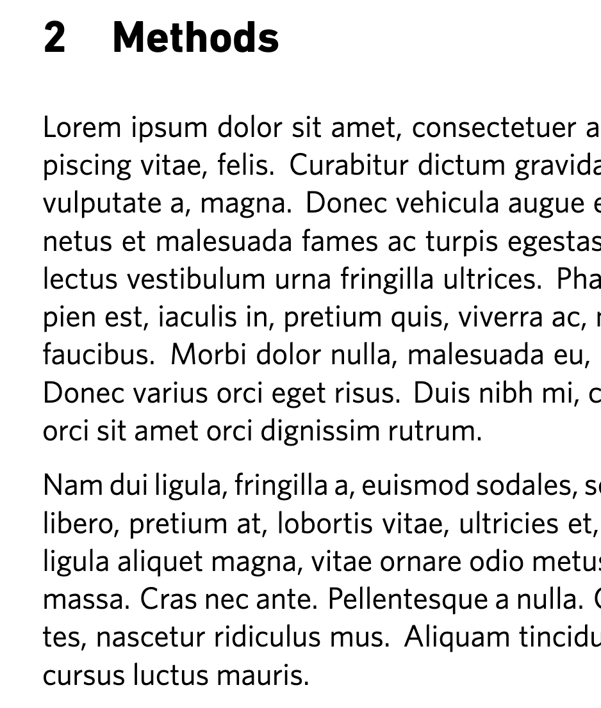
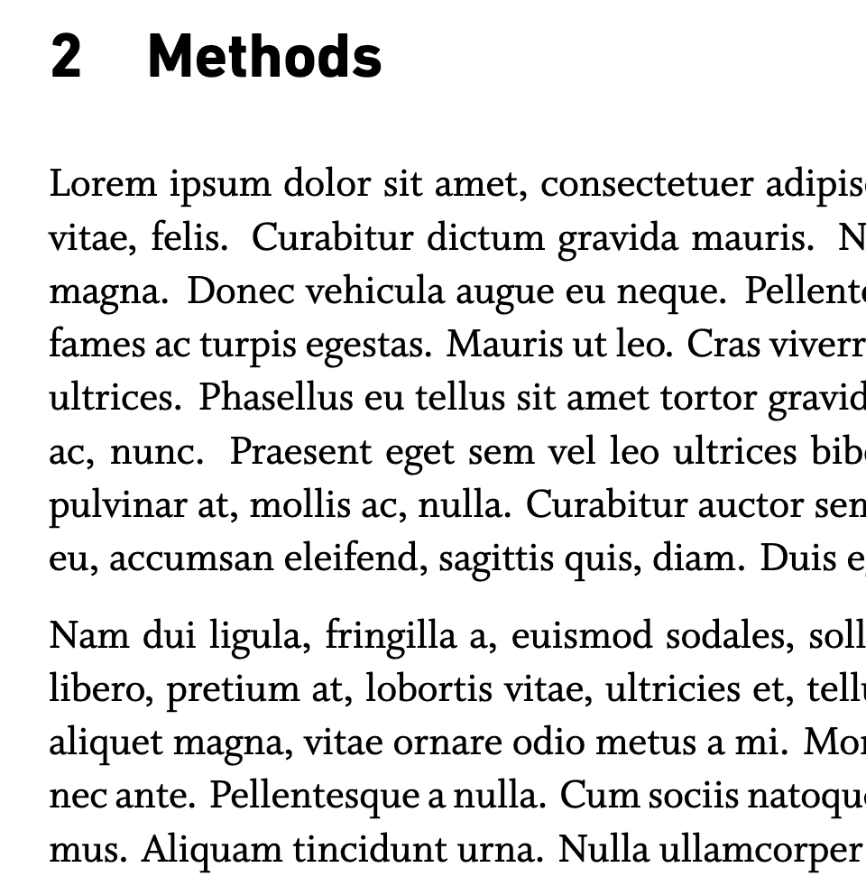

# Jackson Laboratory Paper Template

**Created by: Kumar Lab, The Jackson Laboratory**  
**GitHub: https://github.com/kumarlabjax/LaTeX-Template**

**License**: Dual license system (Proprietary + Creative Commons BY-NC-ND 4.0)  
**Restrictions**: Jackson Laboratory use only - see LICENSE files for details

## 🎯 **Two Template Options**

### **⭐ RECOMMENDED: Clean Version**
- **File**: `jax_main.tex` (120 lines)
- **Professional**: Uses `jacksonlab.sty` package
- **Easy**: `\usepackage[whitney]{jacksonlab}`
- **Clean**: Users see only content, not formatting code

### **Original Version**
- **File**: `jackson_lab_paper.tex` (382 lines)
- **All-in-one**: Everything in single file
- **Educational**: Shows all formatting code
- **Font switch**: Edit line 25

**📖 See `docs/USER_GUIDE.md` for detailed instructions!**

---

## 🎨 **Easy Font Switching - Choose Your Style**

**NEW FEATURE**: Switch between professional fonts with a single line change!

### **Font Options:**

| Font | Style | Best For |
|------|-------|----------|
| **Whitney** | Modern, clean serif | Contemporary research papers |
| **Whitman** | Traditional, readable serif | Classic academic publications |

### **Quick Font Switch:**

```latex
% In jackson_lab_paper.tex, line 23:
\newcommand{\bodyfontchoice}{whitney}  % For Whitney font
\newcommand{\bodyfontchoice}{whitman}  % For Whitman font
```

### **Font Examples:**

**Whitney Font (Modern):**


**Whitman Font (Traditional):**


---

## 🚀 **Quick Start**

### **1. Choose Your Font (30 seconds)**
```latex
% Open jackson_lab_paper.tex and change line 23:
\newcommand{\bodyfontchoice}{whitney}  % Modern, clean
\newcommand{\bodyfontchoice}{whitman}  # Traditional, readable
```

### **2. Compile Your Document**
```bash
# Quick compilation (recommended for most users)
./scripts/compile_simple.sh

# Or use the traditional method
xelatex jax_main.tex
```

### **3. View Your PDF**
Open `jax_main.pdf` to see your paper with the chosen font!

---

## 📋 **What You Have**

You now have a comprehensive LaTeX template system that's perfect for Jackson Laboratory papers:

### **Key Features:**

✨ **Easy Font Switching** - Change between Whitney and Whitman with one line  
📝 **Professional Typography** - DIN Next LT Pro headers + your choice of serif fonts  
🏢 **Jackson Lab Branding** - Official logo, colors, and formatting  
📚 **Complete Bibliography** - BibTeX integration with example references  
🖼️ **Figure Support** - TikZ, PNG, JPG, and other image formats  
⚡ **Auto-Compilation** - Watch mode for instant PDF updates  
📜 **Organized Scripts** - Easy-to-use compilation tools with detailed documentation  

### **Main Files:**

1. **`main_jax.tex`** - **NEW**: Merged strategic document with Jackson Lab formatting
2. **`jackson_lab_paper.tex`** - Original modular template file (includes all sections)
3. **`main3.tex`** - Original strategic document content
4. **`references.bib`** - Bibliography file with all references
5. **`figures/`** - Folder containing all figures and images
6. **`Fonts/`** - **NEW**: Professional fonts (DIN Next LT Pro, Whitney, & Whitman)
7. **`scripts/`** - **NEW**: Organized compilation scripts with detailed documentation

### **Section Files (Edit These for Content):**

1. **`01_introduction.tex`** - Introduction section
2. **`02_methods.tex`** - Methods section
3. **`03_results.tex`** - Results section
4. **`04_discussion.tex`** - Discussion section
5. **`05_supplement.tex`** - Supplement section

## 🎯 **How to Use This Template**

### **Option 1: Use the Merged Strategic Document (Recommended)**

**For the Kumar Lab Strategic Document:**

1. **Use `main_jax.tex`** - This is the merged strategic document with Jackson Lab formatting
2. **Edit content directly** in the main file (all content is preserved from `main3.tex`)
3. **Compile with XeLaTeX** to use the professional fonts

### **Option 2: Use the Modular Template**

**For general Jackson Lab papers:**

1. **Use `jackson_lab_paper.tex`** - This is the modular template
2. **Edit individual section files** for content
3. **Edit the main file** for title page and formatting

### **Step 1: VS Code Setup (Recommended)**

1. **Open the folder** in VS Code/Cursor
2. **Install LaTeX Workshop extension** (optional but recommended)
3. **Use the play button (F5)** to compile your document

### **Step 2: Choose Your Template**

#### **For Strategic Documents:**
- **Use `main_jax.tex`** - Complete strategic document with Jackson Lab formatting
- **All content preserved** from the original strategic document
- **Professional fonts** configured automatically

#### **For Research Papers:**
- **Use `jackson_lab_paper.tex`** - Modular template for research papers
- **Edit section files** for content:
  - **`01_introduction.tex`** - Add your introduction content
  - **`02_methods.tex`** - Add your methods content
  - **`03_results.tex`** - Add your results content
  - **`04_discussion.tex`** - Add your discussion content
  - **`05_supplement.tex`** - Add your supplementary content

### **Step 3: Edit Title Page (Optional)**

Open `jackson_lab_paper.tex` to edit:

- Title, authors, affiliation
- **Author designations** (correspondence, equal contribution, etc.)
- Abstract
- Metadata (code, correspondence, date)

### **Step 4: Compile to PDF**

#### **Option A: VS Code Play Button (Easiest)**

1. **Press F5** or click the play button
2. **Select** "Compile LaTeX (Simple)" from the dropdown
3. **Your PDF** will be automatically generated

#### **Option B: Complete Compilation (with bibliography)**

```bash
./compile_with_bibtex.sh
```

**Note:** Use Option B when you've added new references or changed citations.

### **Step 5: View Your PDF**

Open `jackson_lab_paper.pdf` to see your paper.

## 📝 **What Each Section Does**

### **Title Page (in `jackson_lab_paper.tex`)**

- **Logo**: Your JAX logo appears at the top
- **Title**: Your paper title (currently "SimpleFold: Folding Proteins is Simpler than You Think")
- **Authors**: List of authors with designations (correspondence, equal contribution, etc.)
- **Affiliation**: "The Jackson Laboratory"
- **Abstract**: Your paper's abstract
- **Metadata**: Code repository, correspondence, date

### **Main Paper Sections (Separate Files)**

- **`01_introduction.tex`**: Background, motivation, and contributions
- **`02_methods.tex`**: Data collection, experimental design, statistical analysis
- **`03_results.tex`**: Primary findings, secondary analysis, figures, tables
- **`04_discussion.tex`**: Interpretation, limitations, future directions
- **`05_supplement.tex`**: Additional figures, tables, methods, data
- **References**: Citations and bibliography (in main file)

## 👥 **Author Designations**

### **How to Add Author Designations:**

The template supports standard academic author designations using symbols:

```latex
% Author List with Designations
{\authorfont 
Yuyang Wang*, 
Jiarui Lu*†, 
Navdeep Jaitly, 
Josh Susskind, \\ Miguel Angel Bautista‡}
```

### **Available Symbols:**

- **`*`** = Equal contribution
- **`†`** = Correspondence (corresponding author)
- **`‡`** = Senior author
- **`§`** = Additional designation (customize as needed)

### **Legend:**

The template automatically includes a legend explaining the symbols:

```latex
{\metadatalabelfont *Equal contribution, †Correspondence, ‡Senior author}
```

### **Examples:**

#### **Equal Contribution:**

```latex
{\authorfont 
John Smith*, 
Jane Doe*, 
Bob Johnson}
```

*Legend: *Equal contribution*

#### **Correspondence:**

```latex
{\authorfont 
John Smith†, 
Jane Doe, 
Bob Johnson}
```

*Legend: †Correspondence*

#### **Multiple Designations:**

```latex
{\authorfont 
John Smith*†, 
Jane Doe*, 
Bob Johnson‡}
```

*Legend: *Equal contribution, †Correspondence, ‡Senior author*

### **Updating Correspondence Email:**

When you designate a corresponding author, update the correspondence email in the metadata section:

```latex
{\metadatalabelfont Correspondence:} {\metadatatextfont{\color{blue}\href{mailto:corresponding.author@jax.org}{corresponding.author@jax.org}}}
```

## 🔧 **How to Change Things**

### **Easy Changes (Edit the main template file):**

#### **Change the Title:**

```latex
% In jackson_lab_paper.tex - Replace this line:
{\titlefont\raggedright SimpleFold: Folding Proteins is \newline Simpler than You Think}
% With your title:
{\titlefont\raggedright Your Paper Title Here}
```

#### **Change Authors:**

```latex
% In jackson_lab_paper.tex - Replace this line:
{\authorfont Yuyang Wang, Jiarui Lu*, Navdeep Jaitly, Josh Susskind, \\ Miguel Angel Bautista}
% With your authors:
{\authorfont Your Name, Co-author Name, Another Author}
```

#### **Change Affiliation:**

```latex
% In jackson_lab_paper.tex - Replace this line:
{\affiliationfont The Jackson Laboratory}
% With your affiliation:
{\affiliationfont Your Institution Name}
```

#### **Change Abstract:**

```latex
% In jackson_lab_paper.tex - Replace this text:
{\abstractfont Protein folding is a fundamental problem...}
% With your abstract:
{\abstractfont Your abstract text goes here...}
```

#### **Change Metadata:**

```latex
% In jackson_lab_paper.tex - Update these:
{\metadatalabelfont Code:} {\metadatatextfont\href{https://github.com/your-repo}{https://github.com/your-repo}} \\
{\metadatalabelfont Correspondence:} {\metadatatextfont{\color{blue}\href{mailto:your-email@jax.org}{your-email@jax.org}}} \\
{\metadatalabelfont Date:} {\metadatatextfont Your Date}
```

### **Content Changes (Edit the section files):**

#### **Edit Introduction:**

Open `01_introduction.tex` and replace the placeholder content with your introduction.

#### **Edit Methods:**

Open `02_methods.tex` and replace the placeholder content with your methods.

#### **Edit Results:**

Open `03_results.tex` and replace the placeholder content with your results.

#### **Edit Discussion:**

Open `04_discussion.tex` and replace the placeholder content with your discussion.

#### **Edit Supplement:**

Open `05_supplement.tex` and replace the placeholder content with your supplementary materials.

### **Advanced Changes (Edit the main template file):**

#### **Change Font Sizes:**

Open `jackson_lab_paper.tex` and modify these lines (around lines 80-100):

```latex
% Title font size (currently 20pt)
\newcommand{\titlefont}{\fontsize{20}{24}\selectfont\bfseries\smartfont}

% Author font size (currently 10pt)
\newcommand{\authorfont}{\fontsize{10}{12}\selectfont\bfseries\smartfont}

% Section title font size (currently 16pt)
\newcommand{\sectionfont}{\fontsize{16}{18}\selectfont\bfseries\smartfont}

% Subsection title font size (currently 14pt)
\newcommand{\subsectionfont}{\fontsize{14}{16}\selectfont\bfseries\smartfont}
```

#### **Change Colors:**

```latex
% Around line 130 in main file - Change link colors:
\hypersetup{
    colorlinks=true,
    linkcolor=blue,     % Change this to red, green, etc.
    urlcolor=blue,      % Change this to red, green, etc.
    citecolor=blue      % Change this to red, green, etc.
}
```

## 🚀 **Automatic Compilation**

### **Option 1: VS Code Play Button (Recommended)**

1. **Press F5** or click the play button in VS Code
2. **Select** "Compile LaTeX (Simple)" from the dropdown
3. **Your PDF** will be automatically generated and updated

**Available VS Code configurations:**

- **Compile LaTeX (Simple)** - Quick compilation for content changes
- **Compile LaTeX (with Bibliography)** - Full compilation with bibliography
- **Watch LaTeX (Auto-compile)** - Continuous compilation on file changes

### **Option 2: Use the Watch Script (Terminal)**

```bash
./watch_latex.sh
```

This automatically recompiles your PDF whenever you save changes to your `.tex` file.

### **Option 3: Complete Compilation (Terminal)**

```bash
./compile_with_bibtex.sh
```

This runs the full compilation process including BibTeX for bibliography processing.

### **Option 4: Manual Compilation (Terminal)**

```bash
xelatex jackson_lab_paper.tex
```

## 📚 **Adding Content**

### **Add Text to Sections:**

Edit the appropriate section file. For example, in `01_introduction.tex`:

```latex
\section{Introduction}

Your introduction text goes here. You can write multiple paragraphs.

This is another paragraph.
```

### **Add Subsections:**

In any section file, add subsections like this:

```latex
\subsection{Data Collection}
Your data collection methods here.

\subsection{Analysis}
Your analysis methods here.
```

### **Add Citations:**

#### **In Your Text (any section file):**

```latex
Previous work has shown that protein folding is challenging \cite{jumper2021highly}.
```

#### **In the Bibliography File (`references.bib`):**

```latex
@article{jumper2021highly,
  title={Highly accurate protein structure prediction with AlphaFold},
  author={Jumper, John and Evans, Richard and others},
  journal={Nature},
  volume={596},
  number={7873},
  pages={583--589},
  year={2021},
  publisher={Nature Publishing Group}
}
```

**Note:** The bibliography is automatically generated from `references.bib`. You don't need to manually edit the References section.

### **Add Figures:**

Add figures to the appropriate section file (e.g., `03_results.tex`):

#### **For PNG/JPG Images:**

```latex
\begin{figure}[h]
\centering
\includegraphics[width=0.8\textwidth]{figures/your_figure.png}
\caption{Your figure caption here.}
\label{fig:your_figure}
\end{figure}
```

#### **For TikZ Figures (like the test figure):**

```latex
\begin{figure}[h]
\centering
\input{figures/your_tikz_figure}
\caption{Your figure caption here.}
\label{fig:your_figure}
\end{figure}
```

**Note:** All figures should be placed in the `figures/` folder for better organization.

#### **Test Figure Included:**

The template includes a test figure (`figures/test_figure.tex`) that shows:

- How to create figures with TikZ
- A sample bar chart comparing protein folding methods
- Proper figure referencing in the text
- Professional figure formatting

You can replace this with your own figures or use it as a template for creating new ones.

## 📚 **Bibliography Management**

### **Adding New References:**

1. **Edit `references.bib`** to add new references
2. **Use `\cite{key}`** in your text to cite them
3. **Run `./compile_with_bibtex.sh`** to update the bibliography

### **Reference Types:**

- **`@article{key, ...}`** for journal articles
- **`@book{key, ...}`** for books
- **`@inproceedings{key, ...}`** for conference papers
- **`@misc{key, ...}`** for websites, reports, etc.

### **Example References Included:**

The template includes example references for:

- AlphaFold (Jumper et al., 2021)
- RoseTTAFold (Baek et al., 2021)
- AlphaFold database (Varadi et al., 2022)
- Improved protein structure prediction (Senior et al., 2020)

### **Add Tables:**

Add tables to the appropriate section file:

```latex
\begin{table}[h]
\centering
\begin{tabular}{lcc}
\toprule
Method & Accuracy & Speed \\
\midrule
AlphaFold & 95\% & Slow \\
SimpleFold & 94\% & Fast \\
\bottomrule
\end{tabular}
\caption{Comparison of protein folding methods.}
\label{tab:comparison}
\end{table}
```

## 🎨 **Font System**

### **Professional Font Configuration**

The template now uses **local font files** for consistent, professional typography:

- **Sans-serif (Headers & Titles)**: DIN Next LT Pro from `./Fonts/DIN/`
- **Serif (Main Text)**: Choose between Whitney or Whitman from `./Fonts/Whitney/` or `./Fonts/Whitman/`

### **Font Switching**

The template supports **easy font switching** between Whitney and Whitman for the main body text:

#### **How to Switch Fonts:**

1. **Open `jackson_lab_paper.tex`**
2. **Find line 23** (around the font configuration section):
   ```latex
   \newcommand{\bodyfontchoice}{whitney}
   ```
3. **Change to your preferred font:**
   - For **Whitney**: `\newcommand{\bodyfontchoice}{whitney}`
   - For **Whitman**: `\newcommand{\bodyfontchoice}{whitman}`
4. **Compile with XeLaTeX** - the font will automatically switch

#### **Available Fonts:**

- **Whitney**: Modern, clean serif font (default)
- **Whitman**: Traditional, readable serif font
- **DIN Next LT Pro**: Sans-serif for headers and titles (always used)

### **Font Benefits**

- **Environment Independent**: Works on Overleaf, local LaTeX, and any XeLaTeX environment
- **Professional Typography**: Uses Jackson Lab's preferred fonts for consistent branding
- **No System Dependencies**: Doesn't rely on system fonts that may not be available
- **Consistent Rendering**: Ensures the same appearance across all platforms
- **Easy Switching**: Change fonts with a single line edit

### **Font Configuration**

The fonts are automatically configured in the template using the `fontspec` package:

```latex
% DIN Next LT Pro (Sans-serif) - Always used for headers
\setsansfont{DINNextLTPro}[
    Path=./Fonts/DIN/,
    Extension = .otf,
    UprightFont=*-Regular,
    BoldFont=*-Bold,
    ItalicFont=*-Italic,
    BoldItalicFont=*-BoldItalic
]

% Body font is selected based on \bodyfontchoice
% Whitney configuration:
\setmainfont{Whitney}[
    Path=./Fonts/Whitney/,
    Extension = .otf,
    UprightFont=Whitney-Book,
    BoldFont=Whitney-Bold,
    ItalicFont=Whitney-BookItalic,
    BoldItalicFont=Whitney-BoldItalic
]

% Whitman configuration:
\setmainfont{Whitman}[
    Path=./Fonts/Whitman/,
    Extension = .ttf,
    UprightFont=Whitman-RomanLF,
    BoldFont=Whitman-BoldLF,
    ItalicFont=Whitman-ItalicLF,
    BoldItalicFont=Whitman-BoldLF
]
```

### **Font Requirements**

- **Compiler**: Must use XeLaTeX (not pdfLaTeX)
- **Font Files**: Must be uploaded to your LaTeX project
- **Path Configuration**: Fonts are configured with relative paths to the `Fonts/` folder

## ❓ **Troubleshooting**

### **PDF doesn't update:**

- Make sure you recompiled: `xelatex jackson_lab_paper_template.tex`
- Refresh your PDF viewer

### **Fonts look different:**

- This is normal! The template automatically chooses the best available fonts
- DIN font users see DIN, others see Helvetica
- Whitman font users see Whitman, others see Times New Roman

### **Compilation errors:**

- Check that all files are in the same folder
- Make sure you're using XeLaTeX, not pdflatex
- **"spawn xelatex ENOENT" error**: This means VS Code can't find XeLaTeX. The configuration files now use full paths (`/Library/TeX/texbin/xelatex`) to fix this issue.

## 📁 **File Structure**

```
Your Folder/
├── jax_main.tex                      # ⭐ RECOMMENDED: Clean template (120 lines)
├── jackson_lab_paper.tex             # Original template (382 lines)
├── jacksonlab.sty                    # Professional style package
├── references.bib                    # Bibliography file (edit this)
├── 01_introduction.tex               # Introduction section (edit this)
├── 02_methods.tex                    # Methods section (edit this)
├── 03_results.tex                    # Results section (edit this)
├── 04_discussion.tex                 # Discussion section (edit this)
├── 05_supplement.tex                 # Supplement section (edit this)
├── figures/                          # Figures folder
│   ├── JAX logo.png                  # Your logo
│   ├── test_figure.tex               # Test figure (TikZ)
│   ├── font_example_whitney.png      # Whitney font example
│   └── font_example_whitman.png      # Whitman font example
├── Fonts/                            # Professional fonts directory
│   ├── README.md                     # Font documentation
│   ├── DIN/                          # DIN Next LT Pro fonts (headers)
│   │   ├── DINNextLTPro-Regular.otf
│   │   ├── DINNextLTPro-Bold.otf
│   │   ├── DINNextLTPro-Italic.otf
│   │   └── DINNextLTPro-BoldItalic.otf
│   ├── Whitney/                      # Whitney fonts (body text option)
│   │   ├── Whitney-Book.otf
│   │   ├── Whitney-Bold.otf
│   │   ├── Whitney-BookItalic.otf
│   │   └── Whitney-BoldItalic.otf
│   └── Whitman/                      # Whitman fonts (body text option)
│       ├── Whitman-RomanLF.ttf
│       ├── Whitman-BoldLF.ttf
│       ├── Whitman-ItalicLF.ttf
│       └── Whitman-BoldLF.ttf
├── scripts/                          # **NEW**: Organized compilation scripts
│   ├── README.md                     # Detailed script documentation
│   ├── compile_simple.sh             # Quick compilation
│   ├── compile_with_bibtex.sh        # Full compilation with bibliography
│   └── watch_latex.sh                # Auto-compile on file changes
├── .vscode/                          # VS Code configuration
│   ├── tasks.json                    # Compilation tasks
│   ├── launch.json                   # Debug/run configurations
│   └── settings.json                 # LaTeX settings
├── jackson_lab_paper.pdf             # Generated PDF
└── README.md                         # This user guide
```

## 📄 **About the Merged Document (main_jax.tex)**

### **What is main_jax.tex?**

`main_jax.tex` is a **complete, self-contained document** that merges:
- **All content** from the original strategic document (`main3.tex`)
- **Professional Jackson Lab formatting** and typography
- **Local font configuration** for consistent rendering across environments

### **Key Features:**

- **Complete Strategic Content**: All valuable information from the original document is preserved
- **Professional Formatting**: Jackson Lab title page, fonts, and styling
- **Environment Independent**: Works on Overleaf, local LaTeX, and any XeLaTeX environment
- **Self-Contained**: No external dependencies except the font files
- **Ready to Compile**: Just run XeLaTeX on the file

### **Content Preserved:**

- Strategic imperative for Kumar Lab integration
- 24-hour classifier development cycle proposal
- mHydraNet improvement strategies
- Behavioral indices development
- Technical debt analysis
- Platform ecosystem vision
- All detailed technical discussions and proposals

## 🎯 **Best Practices**

### **For Strategic Documents (main_jax.tex):**
1. **Edit content directly** in the main file
2. **Use XeLaTeX compiler** for font support
3. **Keep font files** in the `Fonts/` folder
4. **Test compilation** after major changes

### **For Research Papers (jackson_lab_paper.tex):**
1. **Modular structure** - each section in its own file for easy management
2. **Edit content in section files** (01_introduction.tex, 02_methods.tex, etc.)
3. **Edit formatting in main file** (jackson_lab_paper.tex)
4. **Edit references in references.bib** - don't edit the References section directly
5. **Put all figures in the figures/ folder** for better organization
6. **Use compile_with_bibtex.sh** when adding new references
7. **Use watch_latex.sh** for quick edits without bibliography changes
8. **Save your work frequently**
9. **Test compilation after major changes**
10. **Keep all files in the same folder**

## 🆘 **Need Help?**

- **Font issues**: Check the font setup section in main file (lines 50-80)
- **Layout problems**: Check the page setup section in main file (lines 30-40)
- **Compilation errors**: Make sure all files are in the same folder
- **Content questions**: Edit the appropriate section file
- **Missing sections**: Check that all section files exist and are included

## 🚀 **Benefits of Modular Structure**

- **Easier collaboration**: Different people can work on different sections
- **Better organization**: Each section is in its own file
- **Faster editing**: Smaller files load and edit faster
- **Version control**: Easier to track changes to specific sections
- **Reusability**: Can reuse sections in other papers

## 🔧 **VS Code/Cursor Setup**

### **Recommended Extensions:**

1. **LaTeX Workshop** - Provides LaTeX support, auto-compilation, and PDF preview
2. **BibTeX Language Support** - Syntax highlighting for .bib files
3. **LaTeX Utilities** - Additional LaTeX tools and snippets

### **How to Install Extensions:**

1. **Open VS Code/Cursor**
2. **Go to Extensions** (Ctrl+Shift+X or Cmd+Shift+X)
3. **Search for** "LaTeX Workshop"
4. **Click Install**

### **Using the Play Button:**

1. **Press F5** or click the play button in the top toolbar
2. **Select** your desired compilation option:
   - **Compile LaTeX (Simple)** - For quick content changes
   - **Compile LaTeX (with Bibliography)** - For reference updates
   - **Watch LaTeX (Auto-compile)** - For continuous compilation
3. **Your PDF** will be automatically generated and updated

### **Keyboard Shortcuts:**

- **F5** - Run/Compile
- **Ctrl+Shift+P** (Cmd+Shift+P) - Command Palette
- **Type "Tasks: Run Task"** - Access all compilation options
