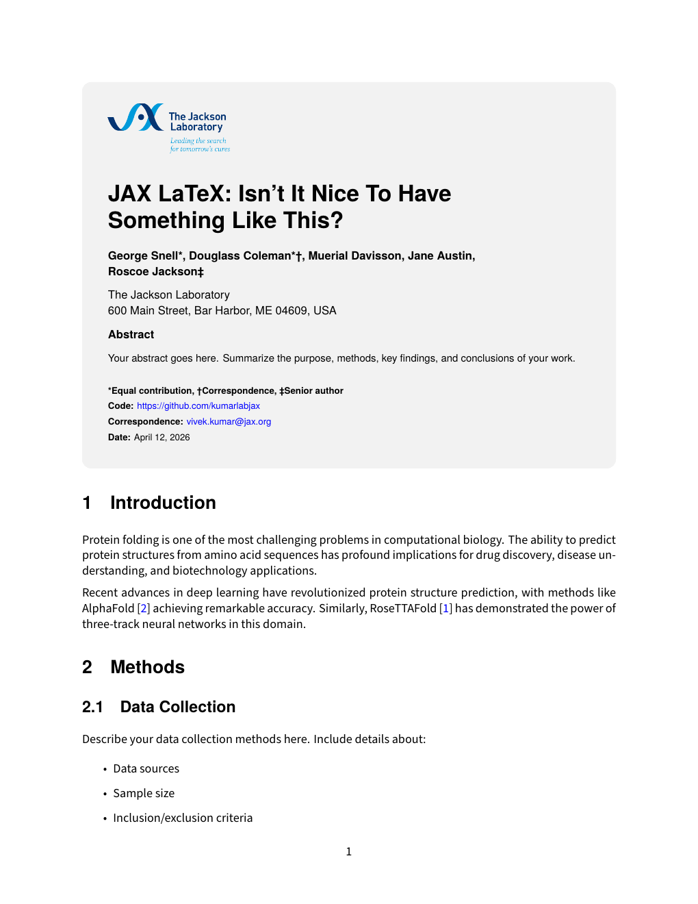
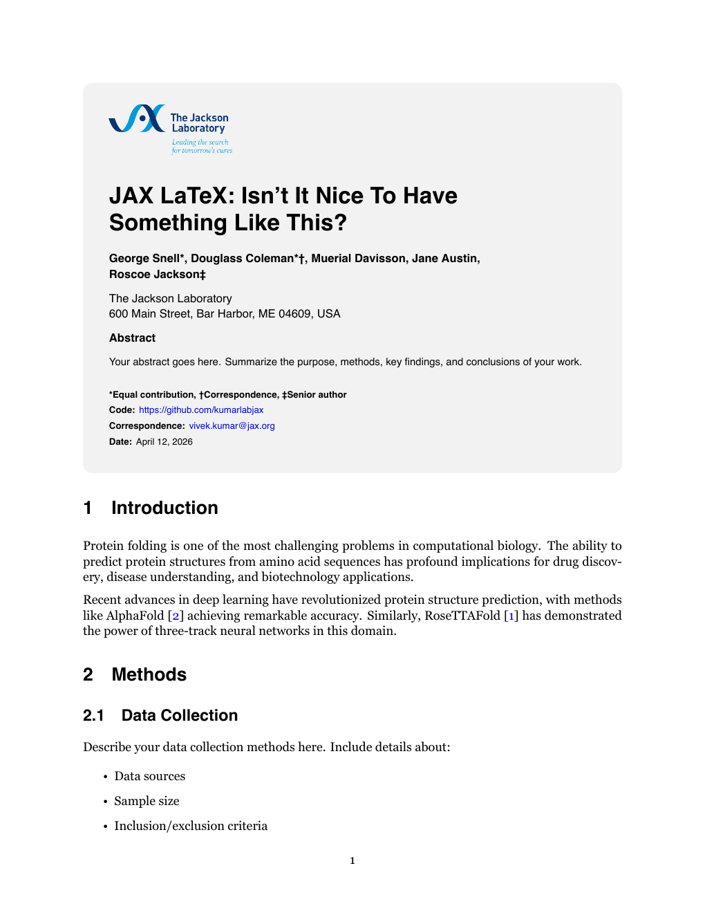
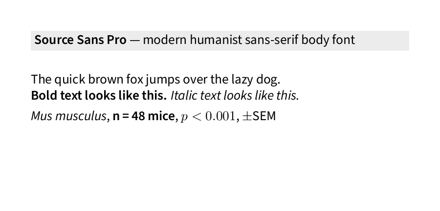
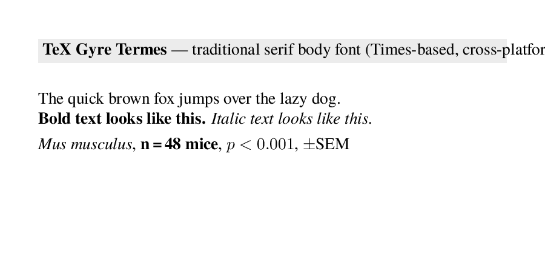

# Jackson Laboratory Paper Template

**Created by: Kumar Lab, The Jackson Laboratory**
**GitHub: https://github.com/vivekJax/KumarLab-LatexTemplate-light**

**License**: Proprietary — Jackson Laboratory use only (see LICENSE)

---

## Sample Output

| Source Sans Pro (Modern) | Georgia (Traditional) |
|:-:|:-:|
|  |  |

Full PDFs: [sample_sourcesans.pdf](sample_sourcesans.pdf) · [sample_georgia.pdf](sample_georgia.pdf)

---

## Choose Your Template

### `jax_main.tex` — Full Paper (Modular)
- **Best for**: Multi-section research papers, collaborative writing
- **Structure**: Each section in its own file (`01_introduction.tex`, `02_methods.tex`, etc.)
- **Why**: Multiple authors can work on different sections simultaneously

### `jax_simple.tex` — Quick Document (Single File)
- **Best for**: Short reports, memos, single-author documents
- **Structure**: Everything in one file — no external section files needed
- **Why**: Fast to start, nothing to set up, just write

Both templates use `jacksonlab.sty` for formatting, so they look identical in the final PDF.

---

## Quick Start

### 1. Pick your template
- Full paper? Open `jax_main.tex` and edit the section files
- Quick document? Open `jax_simple.tex` and write directly

### 2. Choose your font
```latex
\usepackage[sourcesans]{jacksonlab}  % Modern humanist sans-serif (default)
\usepackage[georgia]{jacksonlab}   % Traditional, readable serif
```

### 3. Compile
```bash
# Quick compilation
./scripts/compile_simple.sh

# With bibliography
./scripts/compile_with_bibtex.sh

# Or manually
xelatex jax_main.tex
```

### 4. View your PDF
Open `jax_main.pdf` (or `jax_simple.pdf`) to see your paper.

---

## Font Options

| Font | Style | Best For |
|------|-------|----------|
| **Source Sans Pro** | Modern humanist sans-serif | Contemporary research papers |
| **TeX Gyre Termes** | Traditional, readable serif (Times-based) | Classic academic publications |

All headers and titles use **TeX Gyre Heros** (Helvetica clone). All fonts ship with TeX Live — no system fonts or bundled files needed. Works on Windows, Linux, and macOS.

| Source Sans Pro (Modern) | TeX Gyre Termes (Traditional) |
|:-:|:-:|
|  |  |

---

## What to Edit

### Title Page (in your chosen template)
```latex
% Title
\titletext{Your Title First Line}{Second Line}

% Authors (* = Equal contribution, † = Correspondence, ‡ = Senior author)
{\authorfont First Author*, Second Author†, Third Author‡}

% Institution
{\affiliationfont The Jackson Laboratory \\ 600 Main Street, Bar Harbor, ME 04609, USA}

% Abstract
{\abstractfont Your abstract text here.}
```

### Content

**Full paper** (`jax_main.tex`): Edit the section files:
- `01_introduction.tex` — Introduction
- `02_methods.tex` — Methods
- `03_results.tex` — Results
- `04_discussion.tex` — Discussion
- `05_supplement.tex` — Supplementary materials

**Quick document** (`jax_simple.tex`): Write sections directly in the file.

### References
Add entries to `references.bib`, then cite with `\cite{key}` in your text.

---

## File Structure

```
Your Project/
├── jax_main.tex              # Full paper template (modular)
├── jax_simple.tex            # Quick document template (single file)
├── jacksonlab.sty            # Style package (shared by both templates)
├── 01_introduction.tex       # Introduction (used by jax_main.tex)
├── 02_methods.tex            # Methods (used by jax_main.tex)
├── 03_results.tex            # Results (used by jax_main.tex)
├── 04_discussion.tex         # Discussion (used by jax_main.tex)
├── 05_supplement.tex         # Supplement (used by jax_main.tex)
├── references.bib            # Bibliography
├── figures/                  # Figures folder
│   └── JAX logo.png
└── scripts/                  # Compilation scripts
    ├── compile_simple.sh
    ├── compile_with_bibtex.sh
    └── watch_latex.sh
```

---

## Compilation

| Method | Command | When to Use |
|--------|---------|-------------|
| Simple | `./scripts/compile_simple.sh` | Editing text, quick preview |
| Full | `./scripts/compile_with_bibtex.sh` | Added/changed references |
| Watch | `./scripts/watch_latex.sh` | Active writing, auto-recompile on save |
| Manual | `xelatex jax_main.tex` | Direct compilation |

**Requirement**: Must use **XeLaTeX** (not pdfLaTeX) for font support.

---

## Adding Content

### Figures
```latex
\begin{figure}[h]
\centering
\includegraphics[width=0.8\textwidth]{figures/your_figure.png}
\caption{Your figure caption.}
\label{fig:your_figure}
\end{figure}
```

### Tables
```latex
\begin{table}[h]
\centering
\begin{tabular}{lcc}
\toprule
Method & Accuracy & Speed \\
\midrule
Method A & 95\% & Slow \\
Method B & 94\% & Fast \\
\bottomrule
\end{tabular}
\caption{Your table caption.}
\label{tab:your_table}
\end{table}
```

### Citations
Add to `references.bib`:
```bibtex
@article{key,
  title={Title},
  author={Author},
  journal={Journal},
  year={2024}
}
```
Then cite: `\cite{key}`

Run `./scripts/compile_with_bibtex.sh` after adding new references.

---

## Troubleshooting

| Problem | Solution |
|---------|----------|
| Fonts look wrong | Make sure you're using `xelatex`, not `pdflatex` |
| References show [?] | Run `./scripts/compile_with_bibtex.sh` |
| "spawn xelatex ENOENT" in VS Code | Scripts use full path `/Library/TeX/texbin/xelatex` |
| Permission denied on scripts | Run `chmod +x scripts/*.sh` |
| Style not loading | Make sure `jacksonlab.sty` is in the same folder as your `.tex` file |

---

## Customization

### Font Sizes
Edit `jacksonlab.sty`:
```latex
\newcommand{\titlefont}{\fontsize{20}{28}\selectfont\bfseries\sffamily}
% Change 20 to 18 (smaller) or 22 (larger)
```

### Title Box Colors
Edit `jacksonlab.sty`:
```latex
\newtcolorbox{titlebox}{
    colback=gray!10,  % Change to white, blue!10, etc.
```

### Tables

The template provides table helpers: gray alternating rows, left-aligned cells with hanging indent.

```latex
\begin{table}[h!]
\centering
\begin{minipage}{\mytablewidth}
\centering
\sffamily\small
{\setlength{\tabcolsep}{0pt}%
\begin{tabular}{@{}L{3cm}L{2.5cm}L{\dimexpr\mytablewidth-3cm-2.5cm\relax}@{}}
\toprule
\textbf{Col 1} & \textbf{Col 2} & \textbf{Col 3} \\
\midrule
\gr Shaded row & data & data \\
Unshaded row & data & data \\
\bottomrule
\end{tabular}}
\end{minipage}
\caption{Your caption.}
\end{table}
```

- `L{width}` — left-aligned column with hanging indent on wrap
- `\gr` — gray shading for alternating rows
- `\mytablewidth` — consistent width matching page margins

### Captions with TeX Gyre Termes

When using the **TeX Gyre Termes** body font (`georgia` option), captions automatically render in **TeX Gyre Pagella** (Palatino-based) at 9pt for contrast. No configuration needed.

### Long URLs

If a paragraph with a long URL overflows, wrap it:
```latex
\begin{sloppypar}
Your paragraph with a long \url{https://example.com/very/long/path} here.
\end{sloppypar}
```

---

## VS Code / Cursor Setup

### Recommended Extensions
1. **LaTeX Workshop** — LaTeX support, auto-compilation, PDF preview
2. **BibTeX Language Support** — Syntax highlighting for `.bib` files
